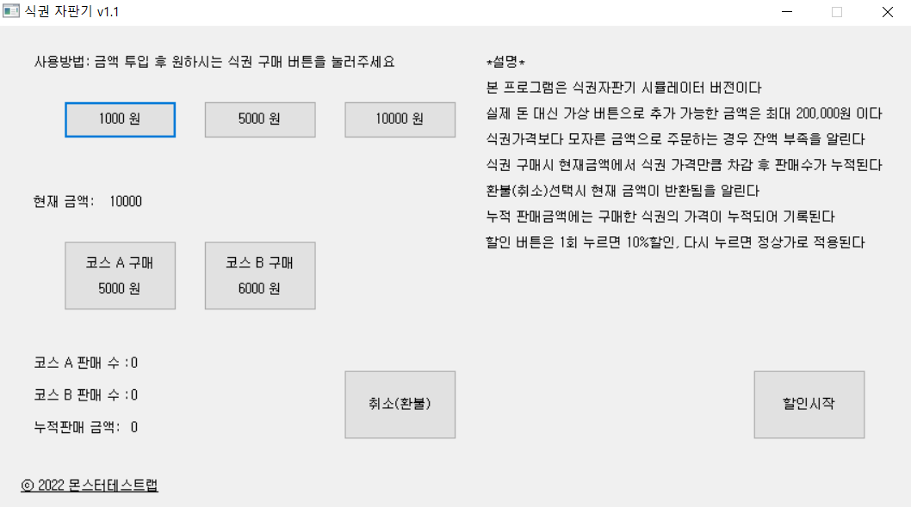

# 식권 자판기 시뮬레이터 테스트

### 🔹 프로젝트 개요

- **특징:** 실제 금액이 아닌 버튼 입력 방식으로 금액을 충전하는 구조
- **최대 충전 금액:** 200,000원
- **목적**: 금액 투입, 할인, 식권 구매, 취소(환불), 누적 판매금액 동작 검증
- **테스트 유형**: 기능 테스트 / 예외 테스트 / 상태 전이 테스트

---

### 🔹 요구사항 정리

- 본 프로그램은 식권자판기 시뮬레이터 버전이다.
실제 돈 대신 가상 버튼으로 추가 가능한 금액은 최대 200,000원이다.
식권가격보다 모자른 금액으로 주문하는 경우 잔액 부족을 알린다.
식권 구매시 현재금액에서 식권 가격만큼 차감 후 판매수가 누적된다.
환불(취소)선택시 현재 금액이 반환됨을 알린다.
누적 판매금액에는 구매한 식권의 가격이 누적되어 기록된다.
할인 버튼 1회 누르면 10%할인, 다시 누르면 정상가로 적용된다.
- 금액 버튼은 1000원, 5000원, 10000원으로 구성
식권은 2종류로 코스A 5000원, 코스B 6000원

---

### 🔹 테스트 관점

- 금액 누적 정확하게 작동하는가
- 최대 충전 금액 200,000원 제한이 정상 동작하는가
- 판매 수, 누적 판매금액 집계가 정확한가
- 할인 버튼이 정확히 동작하는가
- 할인 적용 금액으로 구매/잔액 차감이 정확한가
- 환불(취소) 시 현재 금액 초기화/반환 안내가 잘 작동하는가
- 잔액부족시 안내창이 정상 작동하는가

## 🔹 테스트 목표

사용자가 금액을 충전하고 식권을 구매하는 과정에서 정상적인 결제 및 상태 변경이 이루어지는지 확인하고, 예외 상황에서도 시스템이 올바르게 동작하는지 검증하는 것을 목표로 했다.

---

### 🔹 테스트 케이스

🔎 구매 성공 여부뿐 아니라, 최대 금액 제한, 할인, 잔액 부족, 취소 후 상태 초기화, 누적 판매금액 집계와 같은 상태 변화 중심으로 테스트를 설계했다.

---

| TC ID | 1 Depth | 2 Depth | 3 Depth | 제목 | 사전조건 | 실행 순서 | 기대 결과 | Tester |
|-------|---------|---------|---------|------|----------|-----------|-----------|--------|
| TC001 | 식권자판기 | 금액투입 | 식권구매 | 식권구매 테스트 | 현재 금액 0원 | 1. 식권자판기를 실행시킨다. 2. '5,000원' 금액 버튼을 누른다. 3. '코스 A' 식권 1매 구매한다. | '코스A' 판매 수 +1. 현재금액 0원. 누적 판매금액 +5,000 | 장효선 |
| TC002 | 식권자판기 | 금액투입 | 식권구매 | 식권구매 테스트 | 현재 금액 0원 | 1. 식권자판기를 실행시킨다. 2. '10,000원' 금액 버튼을 누른다. 3. '코스 B' 식권 1매 구매한다. | '코스B' 판매 수 +1. 현재금액 4,000원. 누적 판매금액 +6,000 | 장효선 |
| TC003 | 식권자판기 | 금액투입 | 식권구매 | 식권구매 테스트 | 현재 금액 0원 | 1. 식권자판기를 실행시킨다. 2. '10,000원' 금액 버튼을 누른다. 3. '코스 B' 식권 2매 구매 시도한다. | 코스B 1매 구매 시 판매 수 +1 카운트. 2번째 구매 시 '잔액 부족' 안내창이 뜬다. | 장효선 |
| TC004 | 식권자판기 | 금액투입 | 식권구매 | 식권구매 테스트 | 현재 금액 10,000원 | 1. '코스 A' 식권 2매 구매한다. 2. '5,000원' 금액 버튼을 누른다. 3. '코스 A' 식권 1매 구매한다. | '코스 A' 판매수 +3. 누적 판매금액 15,000원. | 장효선 |
| TC005 | 식권자판기 | 금액투입 | 할인 | 식권구매 할인 테스트 | 현재 금액 10,000원 | 1. '할인시작' 버튼을 누른다. 2. '코스 A' 또는 '코스 B' 식권을 구매한다. | 코스A 4,500원 / 코스B 5,400원으로 표시. 판매수 카운트. 현재금액에서 차감. 누적 판매금액에 반영. | 장효선 |
| TC006 | 식권자판기 | 금액투입 | 할인 | 식권구매 할인 테스트 | 현재 금액 10,000원 | 1. '할인시작' 버튼을 누른다. 2. '코스 A' 식권 1매 구매한다. 3. '코스 B' 식권 1매 구매한다. | 코스A 4,500원 / 코스B 5,400원 적용. 코스A 판매수 +1, 코스B 판매수 +1. 누적 판매금액 10,000원. | 장효선 |
| TC007 | 식권자판기 | 금액투입 | 할인 | 식권구매 할인 테스트 | 현재 금액 10,000원 | 1. '할인시작' 버튼을 1번 누른다. 2. '할인시작' 버튼을 1번 더 누른다. 3. '코스 A' 또는 '코스 B' 식권을 구매한다. | 할인가 표시 후 정상가로 복귀. 판매수 카운트. 현재금액에서 정상가 차감. 누적 판매금액에 반영. | 장효선 |
| TC008 | 식권자판기 | 금액투입 | 취소(환불) | 식권구매 환불 테스트 | 현재 금액 10,000원 | 1. '코스 A' 또는 '코스 B' 식권을 구매한다. 2. '취소(환불)' 버튼을 누른다. | 판매수 카운트. 누적 판매금액 반영. '현재 금액이 반환됨' 안내창이 뜬다. | 장효선 |
| TC009 | 식권자판기 | 금액투입 | 취소(환불) | 식권구매 환불 테스트 | 현재 금액 10,000원 | 1. '취소(환불)' 버튼을 누른다. | '현재 금액이 반환됨' 안내창이 뜬다. | 장효선 |
| TC010 | 식권자판기 | 금액투입 | — | 금액투입 테스트 | 식권자판기 실행 | 1. '10,000원' 금액버튼을 21번 누른다. | '최대 추가금액 초과' 안내창이 뜬다. | 장효선 |
| TC011 | 식권자판기 | 금액투입 | — | 금액투입 테스트 | 식권자판기 실행 | 1. '5,000원' 버튼을 1번 누른다. 2. '10,000원' 금액버튼을 19번 누른다. | '최대 추가금액 초과' 안내창이 뜬다. | 장효선 |
| TC012 | 식권자판기 | 금액투입 | 할인 | 식권구매 환불 테스트 | 현재 금액 10,000원 | 1. '코스 A' 식권 1매 구매한다. 2. '할인시작' 버튼을 누른다. 3. '코스 A' 식권 1매 구매한다. | 코스A 판매수 2 카운트. 누적 판매금액 9,000원 적용. | 장효선 |
| TC013 | 식권자판기 | 금액투입 | 식권구매 | 식권구매 테스트 | 식권자판기 실행 | 1. '코스 A' 또는 '코스 B' 식권 1매 구매 시도한다. | '잔액 부족' 안내창이 뜬다. | 장효선 |

---

### 🔹 결함 리포트

🚨 식권 판매 수와 금액 집계 기능에서 계산 오류가 발생하기 쉬운 영역으로 판단하여 우선적으로 검증했다.

| 결함 No. | 1st Depth | 2nd Depth | 3rd Depth | TC 제목 | Pre-conditions | 테스트 절차 | 기대 결과 | 테스터 | 테스트 일자 | 테스트 환경 | Result | 결함 등급 | 스크린샷 | 결함 현상 |
|----------|-----------|-----------|-----------|---------|----------------|-------------|-----------|--------|-------------|-------------|--------|-----------|----------|-----------|
| defect_1 | 금액투입 | 식권구매 | — | 식권구매 테스트 | 현재 금액 0원 | 1. '10,000원' 금액 버튼을 누른다. 2. '코스 B' 식권 1매 구매한다. | 코스B 판매 수 +1. 현재금액 4,000원. 누적 판매금액 +6,000 | 장효선 | 2026-03-19 AM 10:12 | Windows 11 Pro | Fail | Major | defect_1_1 | '코스B' 1매 구매 후 '판매 수' 1이 카운팅 되지 않는다. |
| defect_2 | 금액투입 | 식권구매 | — | 식권구매 테스트 | 현재 금액 0원 | 1. '코스 B' 식권 1매 구매한다. | '잔액 부족' 안내창이 뜬다. | 장효선 | 2026-03-19 AM 10:19 | Windows 11 Pro | Fail | Major | defect_2_1 | '잔액부족'을 알리는 경고창이 뜨지 않는다. |
| defect_3 | 금액투입 | 식권구매 | — | 식권구매 테스트 | 현재 금액 10,000원 | 1. '코스 B' 식권 2매 구매한다. | 코스B 1매 구매 시 판매 수 +1 카운트. 2번째 구매 시 '잔액 부족' 안내창이 뜬다. | 장효선 | 2026-03-19 AM 10:22 | Windows 11 Pro | Fail | Major | defect_3_1 | '코스B' 1매 구매 후 '판매 수' 1이 카운팅 되지 않고, 한 번 더 눌렀을 경우 '잔액부족' 경고창이 뜨지 않는다. |
| defect_4 | 금액투입 | 식권구매 | 할인 | 식권구매 할인 테스트 | 현재 금액 10,000원 | 1. '할인시작' 버튼을 누른다. 2. '코스 A' 식권 1매 구매한다. 3. '코스 B' 식권 1매 구매한다. | 코스A 4,500원 / 코스B 5,400원 표시. 코스A 판매수 +1, 코스B 판매수 +1. 누적 판매금액 10,000원. | 장효선 | 2026-03-19 AM 10:28 | Windows 11 Pro | Fail | Major | defect_4_1 | '코스A' 구매 후 잔액이 충분함에도 '코스B' 판매 수가 카운팅 되지 않고 누적 판매금액도 추가되지 않는다. |
| defect_5 | 금액투입 | 할인 | 식권구매 | 식권구매 할인 테스트 | 현재 금액 10,000원 | 1. '할인시작' 버튼을 누른다. 2. '코스 B' 식권 1매 구매한다. | 10% 할인된 가격으로 식권이 표시된다. 코스B 판매수 +1. 누적 판매금액 5,400원. | 장효선 | 2026-03-19 AM 10:35 | Windows 11 Pro | Fail | Major | defect_5_1 | '코스B' 1매 구매 후 '판매 수' 1이 카운팅 되지 않고, 누적 판매금액에 할인 금액이 적용되지 않는다. |
| defect_6 | 취소(환불) | — | — | 취소(환불) 테스트 | 현재 금액 10,000원 | 1. 취소(환불) 버튼을 누른다. | '10,000원이 환불되었습니다.' 안내창이 뜬다. | 장효선 | 2026-03-19 AM 10:45 | Windows 11 Pro | Fail | Critical | defect_6_1 | 취소(환불) 버튼을 두 번 누르면 경고창이 뜨면서 강제종료 된다. |
| defect_7 | 금액투입 | — | — | 금액투입 테스트 | 식권자판기 실행 | 1. '5,000원' 버튼을 1번 누른다. 2. '10,000원' 금액버튼을 19번 누른다. | '최대 추가금액 초과' 안내창이 뜬다. | 장효선 | 2026-03-19 AM 10:59 | Windows 11 Pro | Fail | Minor | defect_7_1 | '현재 금액'이 205,000원이 된다. |

- defect_1_1
    
    
    
- defect_6_1
    
    
    

- defect_5_1
    
    
    
- defect_7_1
    
    
    

---

### 🔹 프로젝트를 통해 배운 점

 이번 테스트를 통해 단순 기능 확인도 중요하지만 요구사항을 파악하고 금액 계산, 상태 전이, 누적 데이터 반영과 같이 여러 기능이 연결되는 흐름에서 결함이 발생하기 쉽다는 점을 확인했다.
